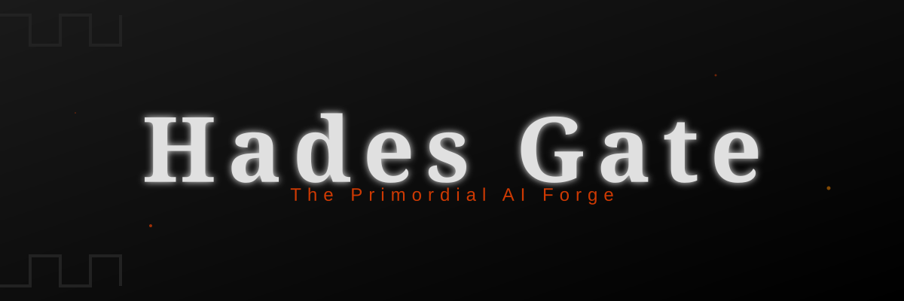

<p align="center">
  
</p>

## 🔥 Materialize your ideas into reality

**Hades Gate** analyzes your raw feature idea, task from 🌊 **[Styx Flow](https://github.com/IGPenguin/styx-flow)** or any similar input within your project context and proposes six orthogonal implementation paths, culminating in a final synthesis:
- **Option A:** The Spark (Fastest path, minimum friction)
- **Option B:** The Weave (Existing systems integration)
- **Option C:** The Apex (High quality, clean architecture)
- **Option D:** The Echo (Standard patterns, reliability)
- **Option E:** The Rift (Experimental, high-risk/high-reward)
- **Option F:** The Chimera (Flashy exterior, pragmatic hacks)
- **The Synthesis:** (Cherry-picked traits from the proposals)

---

## ⚡ Claude Code - Skill

Hades Gate lives natively inside Claude Code as a `/hades` skill. No API keys, no config per project. Install once, invoke from any session.

### Usage

Type `/hades` in any [Claude Code](https://claude.com/product/claude-code) session, provide raw text input, link files or select existing item from `TODOs.md`.
1. Read your project's `CLAUDE.md` if present (instant context, no survey needed)
2. Ask three focused questions - intent, scope, constraints
3. Generate the full Hexalogy + Synthesis inline

Pick a path, tell Claude to implement it. No separate execution step.

### History

Every `/hades` run saves a record to `.hades/YYYY-MM-DD-HHMM-slug.md` - intent, scope, constraints + the analysis.

The skill adds `.hades/` to your `.gitignore` automatically on first use, so your history stays local.

### Tweaking

The proposal template and thinking rules live in your home directory - changes take effect immediately.

| File | Purpose |
| :--- | :--- |
| `~/.claude/hades/papyrus.md` | Proposal template - rename options, add fields, change structure |
| `~/.claude/hades/manifesto.md` | Coding philosophy - quality standards applied to every proposal |

### Setup

```bash
git clone https://github.com/your-repo/hades-gate.git
cd hades-gate
./install-skill.sh
```

Then restart Claude Code.

### Updating

```bash
git pull && ./install-skill.sh
```

And restart Claude Code.

## 🧞‍♂️ Gemini CLI - Legacy

<details>
<summary>The original implementation. Setup required, but works with a free Gemini account.</summary>
<br>

**Prerequisites:** Python 3, [Gemini CLI](https://github.com/google-gemini/gemini-cli) installed, a `GEMINI_API_KEY`.

### Setup & Installation

#### 1. Clone & alias
```bash
git clone https://github.com/your-repo/hades-gate.git ~/Repositories/hades-gate
```
Add to your `~/.zshrc` or `~/.bashrc`:
```bash
alias hades='python3 ~/Repositories/hades-gate/hades.py'
```

#### 2. Add your API key
Create `.hades/erebus.env`:
```bash
GEMINI_API_KEY=your_key_here
```

#### 3. Link a project (Ghostwire Protocol)
```bash
cd ~/Repositories/your-project
hades link
hades status
```

The Ghostwire symlink bridges the Gate's shared rules into your project while keeping transient state out of your git history:

```text
       [ HADES GATE ] (The Source)
      ~/Repositories/hades-gate/
      ├── .hades/
      │   ├── manifesto.md (Central Rules)
      │   └── papyrus.md   (Proposal Template)
      └── hades.py         (The Catalyst)
             │
             │      [ GHOSTWIRE ]
             └──── (Symlink) ──────────┐
                                        ▼
                             [ YOUR PROJECT ]
                             ~/Repositories/your-project/
                             ├── .hades/ ←── (Shared State)
                             ├── TODOs.md    (Versioned Roadmap)
                             └── src/
```

### Commands

| Command | Action |
| :--- | :--- |
| `hades link` | Ghostwire symlink into the active project |
| `hades survey` | Scan project DNA into `arche.md` |
| `hades seed "idea"` | Plant intent into `styx.md` |
| `hades summon "query"` | Pull a task from `TODOs.md` as a seed |
| `hades ignite` | Generate Prions via Gemini into `prions.md` |
| `hades status` | Drift detection + seed count |

### Workflow

1. `cd` into your linked project
2. `hades survey` - capture project DNA
3. `hades seed "what you want to achieve"`
4. `hades ignite` - Gemini generates the Hexalogy into `prions.md`
5. Open a Claude session: *`read .hades/prions.md and implement The Synthesis`*

### Important files

| File | Role |
| :--- | :--- |
| `styx.md` | Active seeds - raw intent being processed |
| `arche.md` | Project DNA (survey output) |
| `prions.md` | Gemini's output - the Hexalogy + Synthesis |
| `erebus.env` | API key storage (never committed) |

</details>

## 🔗 Related

- 🌊 **[Styx Flow](https://github.com/IGPenguin/styx-flow)** - Claude Skill: Turn raw notes into a prioritized backlog (`/styx`)